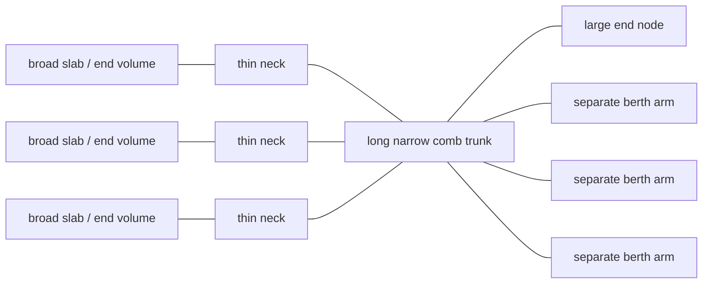
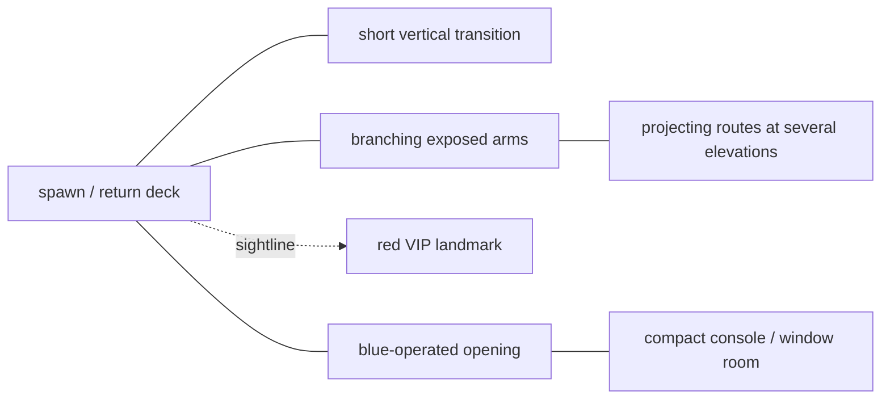
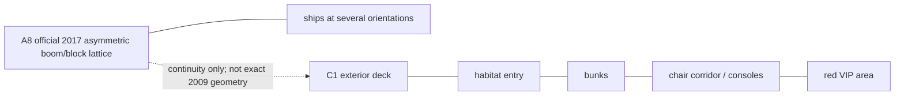
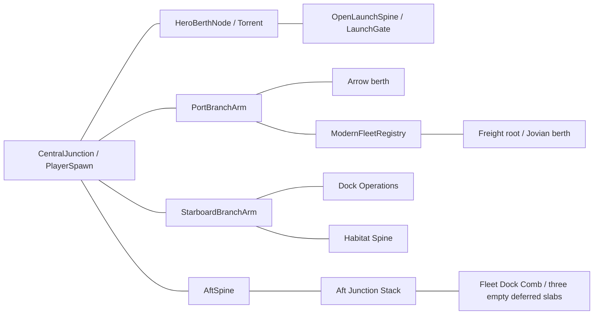

# Confidence-graded station topology

This document is deliberately non-metric for historical observations. No source
supports one canonical floor plan, so B2, B3, A8, and C1 remain separate version
scopes. The exact current-world coordinates are implementation facts, not
recovered historical measurements.

Legend:

- solid line: directly observed traversal or attachment;
- dotted line: direct sightline without a proven route;
- dashed line: inference that must not be promoted to history;
- `LIVE`: current Mudds Shipyards implementation;
- `original_era_observed`, `fixed_era_only`, `later_source_only`,
  `inferred`, and `modern_interpretation`: mandatory evidence labels.

## OE-B2 — original-era comb overview

Source: B2 `04:40–05:10`, with the clearest repeated silhouette around
`04:55`, `05:00`, and `05:05`.

The repeated trunk/rung/slab rhythm and genuine voids are medium-confidence
original-era observations. Exact counts, directions, scale, room functions, and
ship-class assignments are unknown.

## OE-B3 — observed deck/room graph

Source: B3 `00:04–00:52`, return `01:03–01:10`, compact room
`02:40–03:00`, and multi-level routes `06:13–07:10`.

Whether this is the first-login spawn, a death-return location, or both is
unknown. Room function and wider adjacency are also unknown.

## FX-A8 and L-C1 — separate later scopes

A8 is `fixed_era_only`: high confidence for the 2017 image, medium continuity
with the original. C1 is `later_source_only`: visible motifs are medium
confidence, while recording/build provenance and launch-era applicability are
low confidence.

## LIVE — current implementation graph

Every edge below is `modern_interpretation` unless its note explicitly narrows
the claim to a supported motif.

Exact implementation anchors:

| Live branch | Current implementation fact | Evidence boundary |
| --- | --- | --- |
| Central | `PlayerSpawn (-8.5, 0.18, 11)` on `CentralJunction`, centre `(0, 14)`, size `25 × 18`; modern stair reaches the observation landing | B3 supports a spawn/deck/short-transition motif; every coordinate and adjacency is modern. |
| Torrent/launch | Central → JunctionLink → HeroBerthNode at `(0, 1.15, -10)`, then OpenLaunchSpine to `LaunchGate (0, 8, -64)` | Physical berth/launch loop is source-supported; runway, gate, orientation, and dimensions are modern. |
| Port/Arrow | Central → PortBranchArm → Arrow berth `(-43, 1.15, 15.5)`, yaw `90°` | Separate physical berths are source-bounded; Arrow placement and berth shape are modern. |
| Port/registry | Port node → ModernFleetRegistry near `(-43, 27)` | Chat/name regeneration is creator-proven; the terminal and adjacency are new. |
| Port/freight | Registry bypass → freight root `(-53, 0.38, 28.8)` → Jovian berth `(-53, 1.63, 57.3)`, yaw `180°` | Jovian name/role only; branch, interior, and placement are modern. |
| Starboard | Central → StarboardBranchArm → StarboardBerthNode `(43, 15.5)` | Broad orthogonal branching is source-bounded; exact symmetry is modern. |
| Operations | Starboard node → Dock Operations pod near `(43, 27)` | Compact-room motif only; role, shape, and adjacency are modern. |
| Habitat | Habitat root `(49, 0, 15.5)`, yaw `90°`, extends east | C1-inspired later-source interpretation, not recovered original geometry. |
| Aft | Central → AftSpine → AftModuleConnector → AftJunctionStack `(0, 0, 48)` | Open spine/room/vertical motifs are supported; exact module graph is modern. |
| Fleet dock comb | Aft upper deck → visible connector → FleetDockComb `(12, 4.2, 68.3)`, yaw `90°`; local `+Z` becomes the starboard outbound trunk | B2 supports a repeated thin-trunk/rung/broad-slab rhythm and voids. Exact count, dimensions, placement, ramp, style and adjacency are modern; all three dock markers are empty/deferred and non-authoritative. |
| Operational overlay | Activities, ambience, and facade dressing at Central/Aft/Habitat/Freight | Entirely modern presentation; no topology authority. |

## Evidence ledger for topology claims

| Stable ID | Version scope | Node or edge | Source anchor | Confidence | Historical claim | Live mapping | Unknowns |
| --- | --- | --- | --- | --- | --- | --- | --- |
| `OE-B2-COMB` | original era | long trunk with perpendicular rung-like arms | B2 `04:55–05:10` | medium-high | `original_era_observed` | Current orthogonal branches echo but do not reproduce it | count, orientation, scale |
| `OE-B2-SLABS` | original era | broad parallel slabs/end volumes through thin necks and voids | B2 `04:55–05:10` | medium | `original_era_observed` | No strong repeated live equivalent | functions, dimensions |
| `OE-B2-BERTHS` | original era | ships at separate lattice offsets | B2 `04:40–05:10`; B4 `03:43–03:53` | high/medium layout | `original_era_observed` | Three current physical berths | class assignment, simultaneous roster |
| `OE-B3-SPAWN` | observed build | exposed deck and short vertical transition | B3 `00:04–00:52` | medium-high | `original_era_observed` | Central spawn and observation stair | first-login vs return |
| `OE-B3-ROOM` | observed build | deck → blue opening → console/window room | B3 `02:40–03:00` | medium | `original_era_observed` | Dock Operations motif only | function, wider adjacency |
| `OE-B3-LEVELS` | observed build | projecting routes at several elevations | B3 `06:13–07:10` | medium | `original_era_observed` | Aft stack and observation stair | obscured connections |
| `OE-B2-REGEN` | original era | enclosed regeneration/control space | B2 `00:00–01:20` | medium | `original_era_observed` | ModernFleetRegistry is not a reconstruction | exact control functions |
| `OE-B5-TORRENT` | B5-observed | empty berth → spawn → approach → seat → flight | B5 `00:10.200–00:17.000` | high | `original_era_observed` | Central Torrent berth loop | station coordinate/build date |
| `FX-A8-LATTICE` | fixed 2017 | asymmetric booms/blocks and multi-orientation fleet | A8 official image | high fixed/medium continuity | `fixed_era_only` | Broad live lattice language | original-era continuity |
| `L-C1-HAB` | later source | deck → habitat → bunks → chairs/consoles → VIP | C1 `00:00–03:20` | medium visible/low provenance | `later_source_only` | Habitat Spine motifs | build, date, original applicability |
| `INF-UNIFIED` | cross-source | all subgraphs form one exact station | none | low/unsupported | `inferred` | Current graph is one authored interpretation | every exact join |

## Implemented bounded macro correction and remaining boundary

The strongest mismatch is macro composition, not missing decoration. The live
station reads as a wide `T/+` hub with one dominant forward launch deck and
three bespoke branches. B2 instead gives the clearest original-era overview as
a repeated comb/ladder rhythm: long thin trunk, short rungs, broad separated
slabs or berth nodes, and large voids.

The first evidence-safe architecture correction is now the bounded
`fleet-dock-comb`:

1. A visible collision-backed bridge continues from the Aft upper circulation
   into a narrow 48 m outbound trunk.
2. Three short orthogonal teeth terminate in broad physically separated slabs.
3. All three dock markers remain empty, unassigned and explicitly deferred.
4. Genuine voids remain; no hidden full-footprint collision slab exists.
5. One short ramp supplies a second local elevation without importing C1
   habitat adjacency.
6. The exact three existing lease-bound berths and their routes remain unchanged.

This corrects one high-confidence silhouette mismatch without establishing a
canonical floor plan or populating unsupported ship reconstructions. Further
station expansion still requires new evidence or equally explicit modern/deferred
boundaries.
