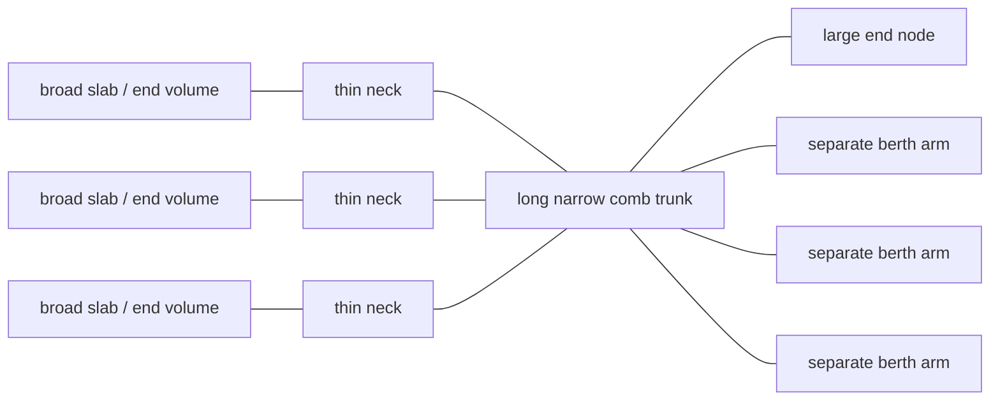
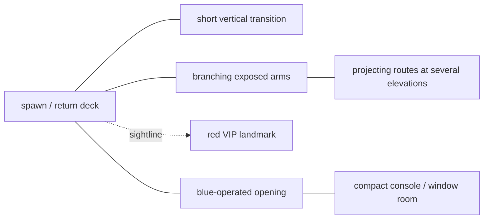
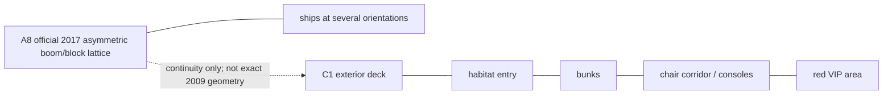
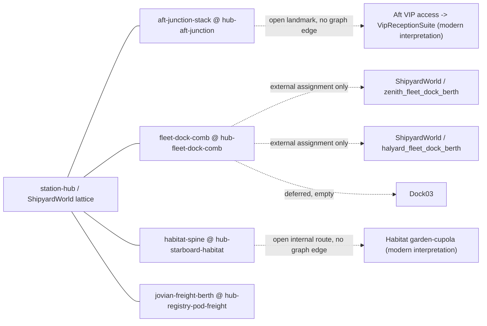
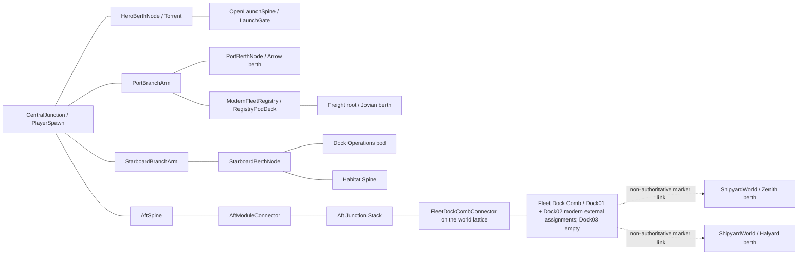

# Confidence-graded station topology

This document is deliberately non-metric for historical observations. No source
supports one canonical floor plan, so B2, B3, A8, and C1 remain separate version
scopes. The exact current-world coordinates are implementation facts, not
recovered historical measurements.

Legend:

- solid line: directly observed traversal or attachment;
- dotted line: direct sightline without a proven route;
- dashed line: inference that must not be promoted to history;
- `LIVE`: current Mudds Shipyards implementation;
- `original_era_observed`, `fixed_era_only`, `later_source_only`,
  `inferred`, and `modern_interpretation`: mandatory evidence labels.

Element labels used by the per-relationship grading below:

- `observed`: a registered ledger anchor shows the motif in its own version
  scope. It never authenticates the live geometry that echoes it.
- `inferred`: a reading that joins or extends registered material. It must not
  be promoted to history.
- `fixed-era-inspired`: taken from A8 or C1. For C1 this label is itself an
  inference, because C1's own ledger limitation records its fixed-build
  provenance as unverified.
- `new`: project-original. No source constrains it.
- `unknown`: the relationship cannot be graded from the material held. This is
  a legitimate and common outcome here and is never resolved in the project's
  favour.

## Citation provenance boundary

The Phase-1 exit gate requires an independent reader to reproduce a topology
claim from `source_ledger.json`. Several timestamps quoted in the historical
sections below are **not** registered anchors in that ledger, so they cannot be
checked by a reader who only holds the ledger. They are retained here, marked,
rather than deleted, because removing them would hide the gap:

| Citation used below | Registered as a ledger anchor? |
| --- | --- |
| B2 `00:00–01:20` | yes |
| B2 `04:55–05:10` | yes |
| B2 `04:40` (start of the OE-B2 range) | no |
| B3 `00:04–00:52` | yes |
| B3 `01:03–01:10` return | no |
| B3 `02:40–03:00` compact room | no; B3 carries the `station.compact_console_window_room` claim with no anchor pinning it |
| B3 `06:13–07:10` multi-level routes | no; no registered B3 anchor covers elevation beyond the `00:04–00:52` "short vertical transition" |
| B4 `03:43–03:53` | no; B4's registered anchors are `f1739` and `f1742` |
| B5 `00:10.200`, `00:10.733`, `00:15.500` | yes; the quoted `–00:17.000` bound is a document-side range, not an anchor |
| C1 `01:20`, `01:50`, `02:00`, `03:20` | yes; the quoted `00:00` range start is not an anchor |

Nothing in the `LIVE` section depends on an unregistered citation.

## OE-B2 — original-era comb overview

Source: B2 `04:40–05:10`, with the clearest repeated silhouette around
`04:55`, `05:00`, and `05:05`.

The repeated trunk/rung/slab rhythm and genuine voids are medium-confidence
original-era observations. Exact counts, directions, scale, room functions, and
ship-class assignments are unknown.

## OE-B3 — observed deck/room graph

Source: B3 `00:04–00:52`, return `01:03–01:10`, compact room
`02:40–03:00`, and multi-level routes `06:13–07:10`.

Whether this is the first-login spawn, a death-return location, or both is
unknown. Room function and wider adjacency are also unknown. Only the
`00:04–00:52` anchor is ledger-registered; the compact room and the multi-level
routes rest on unregistered citations and are graded accordingly below.

## FX-A8 and L-C1 — separate later scopes

A8 is `fixed_era_only`: high confidence for the 2017 image, medium continuity
with the original. C1 is `later_source_only`: visible motifs are medium
confidence, while recording/build provenance and launch-era applicability are
low confidence.

## LIVE — current implementation graph

Every edge below is `modern_interpretation` unless its note explicitly narrows
the claim to a supported motif.

### How the live graph is actually joined

Adjacency in the running world is **declared, not metric**. Each station module
tags exactly one route marker with the meta `station_connection_slot`, whose
value is a slot ID; `ShipyardWorld` publishes the matching hub endpoint over
real lattice geometry; `StationRouteRegistry` records a slot claimed by exactly
two endpoints as one edge. Two modules can therefore never pair directly with
each other — that state is rejected as a conflict — and two markers drifting
onto the same coordinate can never manufacture an edge.

Consequently every live edge runs **module ↔ station hub**. Any module-to-module
line drawn below would be false.

The physical circulation the player walks is a separate, weaker statement. The
registry does not prove a walkable route; `station_surface_playability_test.gd`
and the per-module suites do. Read the sketch below as physical description
only:

The comb's connector deck is a child of the world's `ExposedDockLattice`, not of
the Aft Junction Stack. The comb's declared edge is to the station hub. The Aft
module's own upper deck is physically continuous with that connector, but that
continuity is a walkability fact, not a recorded graph edge.

### Machine-checked live registry totals

<!-- LIVE-GRAPH-TOTALS:BEGIN -->

| Quantity | Value |
| --- | --- |
| `module_count` | 4 |
| `hub_endpoint_count` | 4 |
| `connection_slot_count` | 4 |
| `edge_count` | 4 |
| `route_marker_count` | 29 |
| `resolved_route_marker_count` | 29 |
| `dangling_slot_count` | 0 |
| `overclaimed_slot_count` | 0 |
| `authority_claim_count` | 0 |
| `production_berth_count` | 5 |
| `deferred_or_dead_end_route_marker_count` | 4 |

<!-- LIVE-GRAPH-TOTALS:END -->

### Machine-checked live edges

Every row is one slot claimed by exactly one hub endpoint and exactly one
module. The hub anchor path is relative to the `ShipyardWorld` node.

<!-- LIVE-GRAPH-EDGES:BEGIN -->

| Slot ID | Station hub anchor | Module ID | Module route marker | Module evidence status |
| --- | --- | --- | --- | --- |
| `hub-aft-junction` | `ExposedDockLattice/AftModuleConnector` | `aft-junction-stack` | `approach` | `modern_interpretation` |
| `hub-fleet-dock-comb` | `ExposedDockLattice/FleetDockCombConnector/FleetDockCombConnectorDeck` | `fleet-dock-comb` | `approach` | `modern_interpretation` |
| `hub-registry-pod-freight` | `ModernFleetRegistry/RegistryPodDeck` | `jovian-freight-berth` | `approach` | `creator_roster_supported_modern_interpretation` |
| `hub-starboard-habitat` | `ExposedDockLattice/StarboardBerthNode` | `habitat-spine` | `approach` | `fixed_era_inspired_modern_interpretation` |

<!-- LIVE-GRAPH-EDGES:END -->

Two modules publish a compound evidence status that is narrower than plain
`modern_interpretation` and that is **not** part of the five-value Phase-1
status vocabulary: `fixed_era_inspired_modern_interpretation` (habitat) and
`creator_roster_supported_modern_interpretation` (freight). Both resolve to
`modern_interpretation` for Phase-1 purposes; the prefix records which weak
source inspired the module and never raises its confidence.

### Machine-checked module route rosters

<!-- LIVE-GRAPH-ROUTES:BEGIN -->

| Module ID | Route markers | Connection slot marker | Deferred or dead-end markers |
| --- | --- | --- | --- |
| `aft-junction-stack` | `approach`, `lower-junction`, `operations-room`, `stair-base`, `stair-top`, `upper-floor`, `vip-landmark` | `approach` | `vip-landmark` |
| `fleet-dock-comb` | `approach`, `dock-01-threshold`, `dock-02-threshold`, `dock-03-threshold`, `trunk-aft`, `trunk-forward`, `trunk-mid`, `vertical-base`, `vertical-top` | `approach` | `dock-01-threshold`, `dock-02-threshold`, `dock-03-threshold` |
| `habitat-spine` | `approach`, `common-entry`, `deferred-branch`, `habitat-corridor`, `observation`, `threshold` | `approach` | — |
| `jovian-freight-berth` | `approach`, `apron-threshold`, `boarding-staging`, `cargo-rack`, `cargo-transfer`, `service-room`, `service-threshold` | `approach` | — |

<!-- LIVE-GRAPH-ROUTES:END -->

Every marker other than `approach` is an internal waypoint or a deliberate dead
end and never joins the adjacency graph.

### Machine-checked non-slot landmarks

<!-- LIVE-GRAPH-DEFERRED:BEGIN -->

| Landmark | Module ID | Route marker | World origin | Live gate |
| --- | --- | --- | --- | --- |
| Aft VIP access | `aft-junction-stack` | `vip-landmark` | `(-5.15, 4.35, 66.9)` | `VIPAccess` door, open, onto `VipReceptionSuite` — a `modern_interpretation` interior at confidence `none` |
| Comb dock 01 threshold | `fleet-dock-comb` | `dock-01-threshold` | `(22.0, 4.35, 59.05)` | marker `assigned-dock-01`, `assigned_external`, external berth `zenith_fleet_dock_berth` |
| Comb dock 02 threshold | `fleet-dock-comb` | `dock-02-threshold` | `(37.0, 4.35, 59.05)` | marker `deferred-dock-02`, `assigned_external`, external berth `halyard_fleet_dock_berth` |
| Comb dock 03 threshold | `fleet-dock-comb` | `dock-03-threshold` | `(52.0, 6.75, 59.05)` | marker `deferred-dock-03`, `deferred_empty` |

<!-- LIVE-GRAPH-DEFERRED:END -->

All four remain outside the adjacency graph, for different explicit reasons:
Dock 01 and Dock 02 are modern external berth links owned by `ShipyardWorld`,
Dock 03 alone is empty/deferred, and the Aft VIP landmark opens onto
`VipReceptionSuite`. That room is invented and is
labelled as invented — element `new`, status `modern_interpretation`, source
confidence `none` — and its existence upgrades no evidence: no source describes
the inside of any VIP area, and the two VIP fragments the ledger holds remain
unjoined. The marker stays out of the adjacency graph, because the suite is an
interpretation interior rather than a registered station module.

The habitat's side branch was previously a fifth row of this table and has been
removed from it, because it is no longer deferred. Its `DeferredBranchAccess` door is
unlocked and its `deferred-branch` marker now leads to a built room, the
`garden-cupola` bay. **That is a content change, not an evidence change.** No
source describes anything behind that door; the room is wholly invented, is
labelled `fixed_era_inspired_modern_interpretation` like the rest of the module,
and is recorded as invented in the module's `content_note`, its
`modern_interpretations` list and the evidence-status table below. Removing the
row is what keeps this table honest: a non-slot-landmark table that still listed
a door you can walk through would be the false statement.

These four rows are current, and the marker rule above still holds for them.

### Machine-checked production berths

`ShipyardWorld` owns every berth. No station module owns berth, lease, landing,
boarding, or spawn authority, and the registry records zero authority claims.

<!-- LIVE-GRAPH-BERTHS:BEGIN -->

| Berth ID | World origin | Yaw (degrees) |
| --- | --- | --- |
| `arrow_recon_berth` | `(-43.0, 1.15, 15.5)` | `90` |
| `central_berth` | `(0.0, 1.15, -10.0)` | `0` |
| `jovian_freight_berth` | `(-53.0, 1.63, 57.3)` | `180` |
| `zenith_fleet_dock_berth` | `(22.0, 5.28, 53.3)` | `0` |
| `halyard_fleet_dock_berth` | `(37.0, 5.28, 53.3)` | `0` |

<!-- LIVE-GRAPH-BERTHS:END -->

Exact implementation anchors:

| Live branch | Current implementation fact | Evidence boundary |
| --- | --- | --- |
| Central | `PlayerSpawn (-8.5, 0.18, 11)` on `CentralJunction`, centre `(0, 14)`, size `25 × 18`; modern stair reaches the observation landing at `(-11.5, 3.05, 3.0)` | B3 supports a spawn/deck/short-transition motif; every coordinate and adjacency is modern. |
| Torrent/launch | Central → JunctionLink → HeroBerthNode at `(0, 1.15, -10)`, then OpenLaunchSpine to `LaunchGate (0, 8, -64)` | Physical berth/launch loop is source-supported; runway, gate, orientation, and dimensions are modern. |
| Port/Arrow | Central → PortBranchArm → PortBerthNode → Arrow berth `(-43, 1.15, 15.5)`, yaw `90°` | Separate physical berths are source-bounded; Arrow placement and berth shape are modern. |
| Port/registry | Port node → ModernFleetRegistry, `RegistryPodDeck (-43, 0.18, 27)` | Chat/name regeneration is creator-proven; the terminal and adjacency are new. |
| Port/freight | `RegistryPodDeck` publishes the `hub-registry-pod-freight` endpoint; freight root `(-53, 0.38, 28.8)` claims it through its `approach` marker at `(-53, 0.53, 25.4)`, and the module carries the Jovian berth `(-53, 1.63, 57.3)`, yaw `180°` | Jovian name/role only; branch, interior, and placement are modern. The slot pairs by declaration, not by the roughly 10 m coordinate offset between the two endpoints. |
| Starboard | Central → StarboardBranchArm → StarboardBerthNode `(43, -0.62, 15.5)`, which publishes the `hub-starboard-habitat` endpoint | Broad orthogonal branching is source-bounded; exact symmetry is modern, and A8 shows an asymmetric lattice, so the live mirrored pair is not an A8 continuity claim. |
| Operations | Starboard node → Dock Operations pod, `OperationsPodFloor (43, 0.18, 27)` | Compact-room motif only; role, shape, and adjacency are modern. |
| Habitat | Habitat root `(49, 0, 15.5)`, yaw `90°`, extends east; `approach` marker at `(46, 0.15, 15.5)` claims `hub-starboard-habitat` | C1-inspired later-source interpretation, not recovered original geometry. |
| Aft | Central → AftSpine → AftModuleConnector `(0, -0.62, 43.5)` → AftJunctionStack `(0, 0, 48)`, whose `approach` marker at `(0, 0.15, 46.3)` claims `hub-aft-junction` | Open spine/room/vertical motifs are supported; exact module graph is modern. |
| Fleet dock comb | `FleetDockCombConnector` is a child of the world's `ExposedDockLattice`, physically continuing past the Aft upper deck; its `FleetDockCombConnectorDeck (6, 3.88, 68.3)` publishes `hub-fleet-dock-comb`, which FleetDockComb `(12, 4.2, 68.3)`, yaw `90°`, claims through its `approach` marker at `(13, 4.35, 68.3)`. Local `+Z` becomes the starboard outbound trunk, `48 m` long. Its Dock01 marker is externally assigned by `ShipyardWorld` to the modern Zenith berth `zenith_fleet_dock_berth` at `(22, 5.28, 53.3)` and its Dock02 marker to the modern Halyard berth `halyard_fleet_dock_berth` at `(37, 5.28, 53.3)`; Dock03 remains empty/deferred. All three markers and the module itself remain non-authoritative. | B2 supports a repeated thin-trunk/rung/broad-slab rhythm and voids. Exact count, dimensions, placement, ramp, style, adjacency, dock numbering, and both external assignments are modern; no source authenticates a historical class-to-berth topology. The comb's graph edge is to the station hub, not to the Aft module. |
| Production berth registry | `ShipyardWorld` owns exactly five lease-bound production berths: Central/Torrent, Arrow, Jovian, Zenith, and Halyard. FleetDockComb owns none of their berth, lease, landing, boarding, or spawn authority. | The registry, exact placements, lease behavior, and class assignments are implementation facts and `modern_interpretation`, not source-authenticated topology. |
| Operational overlay | Activities, ambience, and facade dressing at Central/Aft/Habitat/Freight | Entirely modern presentation; no topology authority. |

## Per-relationship confidence grading

This grades the relationships Phase 3 names: habitat, VIP, platform, ladder,
regeneration, dock-arm, and room. It is a grading of what exists, not a claim
that these relationships were recovered. Where a relationship has no registered
anchor its evidence anchor is `unknown` and its label is `new` or `inferred`.

### Habitat relationships

| Relationship | Live implementation | Label | Evidence anchor | Status | Unknowns |
| --- | --- | --- | --- | --- | --- |
| A habitat entry exists | `HabitatSpine/MainAccess` pressure door, module-local `(0, 0, 0.72)` | fixed-era-inspired | C1 `01:20` "Habitat entry" | `later_source_only` | recording date, build revision, launch-era applicability |
| Bunks exist in a habitat | six bunk alcoves, markers `BunkAlcoveMarker01`–`06` | fixed-era-inspired | C1 `01:50` "Bunks" | `later_source_only` | count, spacing, geometry, deck |
| The count of six alcoves | six | new | none | `modern_interpretation` | historical count |
| A chair-lined habitat route exists | `habitat-corridor` marker `(59.15, 0.15, 15.5)` | fixed-era-inspired | C1 `02:00` "Chair-lined corridor" | `later_source_only` | length, width, chair spacing |
| Eight-chair observation/common room | `observation` `(74.3, 0.15, 15.5)`, `common-entry` `(67.65, 0.15, 15.5)`, nine window panes | new | none for the room's function or chair count | `modern_interpretation` | whether any observed chair/window space is station or ship interior |
| Habitat attaches to the starboard node | `hub-starboard-habitat` at `StarboardBerthNode`, root `(49, 0, 15.5)` yaw `90°` | new | none | `modern_interpretation` | every historical join |
| Side branch garden bay | `deferred-branch` `(69.0, 0.15, 4.9)`, inside the `garden-cupola` room beyond the unlocked `DeferredBranchAccess` | new | none | `modern_interpretation` | whether any adjacent room ever existed, and what it was |

The module publishes `fixed_era_inspired_modern_interpretation`. Its inspiration
is C1, which the ledger classes `later_source_only` with unverified fixed-build
provenance, so "fixed-era" is itself an inference and must not be read as an A8
fixed-build attribution.

### VIP relationships

| Relationship | Live implementation | Label | Evidence anchor | Status | Unknowns |
| --- | --- | --- | --- | --- | --- |
| A red VIP landmark is visible from the spawn deck | — (sightline only; nothing is built to reproduce it) | observed | B3 `00:04–00:52` "…and red VIP sightline" | `original_era_observed` | distance, elevation, whether any route reached it |
| A red VIP area with an interior | — (deliberately not built) | fixed-era-inspired | C1 `03:20` "Red VIP area" | `later_source_only` | contents, plan, provenance, era |
| Live VIP door and landmark | `AftJunctionStack/VIPAccess` plus `vip-landmark` `(-5.15, 4.35, 66.9)` | new | none | `modern_interpretation` | placement, elevation, adjacency to the operations room |
| Live VIP interior behind that door | `VipReceptionSuite` (threshold, reception lounge, outboard glazing), cantilevered off the aft upper deck | new | none | `modern_interpretation` at confidence `none` | everything: whether any original interior existed, its plan, contents, materials, lighting, scale and era |
| Any traversable route from a spawn deck to a VIP interior | none exists | unknown | none | `unknown` | B3 gives a sightline, C1 gives an area; no source joins them |

### Platform and elevation relationships

| Relationship | Live implementation | Label | Evidence anchor | Status | Unknowns |
| --- | --- | --- | --- | --- | --- |
| An exposed spawn/return deck and short vertical transition occur within one observed sequence | `JunctionAccessRamp` at Central with seven visible treads, reaching `ObservationLanding (-11.5, 3.05, 3.0)` | observed relationship; modern implementation form | B3 `00:04–00:52` "Exposed spawn/return deck, short vertical transition, branching arms, and red VIP sightline." | `original_era_observed` for the bounded observation; `modern_interpretation` for the live stair/ramp | whether the transition was a ladder, stair, ramp or other form; exact adjacency, rise, tread count and placement |
| Projecting routes at several elevations | Aft upper floor at `4.2 m`, comb slabs at `4.2 m` and the upper slab reached at `6.75 m` | inferred | none registered; the B3 `06:13–07:10` citation is not a ledger anchor | `unknown` | how many elevations existed and how they connected |
| Broad separated end volumes act as platforms | comb `dock-slab-01`, `dock-slab-02`, `dock-slab-03-upper` | observed | B2 `04:55–05:10` "broad slabs, and voids" | `original_era_observed` | count, scale, elevation, function |
| Individual live platform decks | `RegistryPodDeck (-43, 0.18, 27)`, `OperationsPodFloor (43, 0.18, 27)`, `FleetDockCombConnectorDeck (6, 3.88, 68.3)` | new | none | `modern_interpretation` | every dimension and adjacency |

### Ladder relationships

| Relationship | Live implementation | Label | Evidence anchor | Status | Unknowns |
| --- | --- | --- | --- | --- | --- |
| Any ladder anywhere in the station | none; the station has no ladder at all | unknown | none — no registered anchor in any source names a ladder | `unknown` | whether the original build used ladders at all |

All live vertical circulation is stairs or ramps: one continuous ramp with seven
visible treads at Central, a fifteen-step stair inside the Aft Junction Stack
rising `4.2 m`, and one short ramp in the comb from `vertical-base (52, 4.35,
66.3)` to `vertical-top (52, 6.75, 59.3)`. B3's registered anchor says only
"short vertical transition" and does not identify a ladder.

The runtime now carries the same boundary in metadata: B3 supports the bounded
"short vertical transition" observation, while `implementation_form` records the
live geometry as `modern_stair_ramp`, `historical_form_identified` is false, and
`historical_ladder_supported` is false. This metadata does not promote the
modern ramp or its seven visible treads into source evidence.

### Regeneration relationships

| Relationship | Live implementation | Label | Evidence anchor | Status | Unknowns |
| --- | --- | --- | --- | --- | --- |
| An enclosed regeneration/control space exists | — (not reconstructed) | observed | B2 `00:00–01:20` "Regeneration/control room." | `original_era_observed` | plan, scale, controls, adjacency |
| A regeneration label precedes a craft appearing at a fixed empty berth without a cut | — (not a station-topology feature) | observed | B5 `f306`/`f322`, B4 `f1739`/`f1742`, B7 `f368`/`f373` | `original_era_observed` | which berth, which station revision |
| Live fleet registry pod and terminal | `ModernFleetRegistry` at `(-43, 0.18, 27)`, `FleetRegistryTerminal (-43, 1.45, 24.6)` with a modern "SAY SHIP NAME" screen | new | none | `modern_interpretation` | it is not a reconstruction of B2's regeneration room |
| Whether B2's regeneration/control room and the observed regeneration labels are the same space | — | unknown | none | `unknown` | the join is unsupported |

The live pod holds no regeneration authority. It publishes the
`hub-registry-pod-freight` endpoint and nothing else in the graph.

### Dock-arm relationships

| Relationship | Live implementation | Label | Evidence anchor | Status | Unknowns |
| --- | --- | --- | --- | --- | --- |
| A long narrow trunk carries perpendicular rung-like arms | FleetDockComb, `48 m` trunk, three rungs, three slabs, at `(12, 4.2, 68.3)` yaw `90°` | observed | B2 `04:55–05:10` `OE-B2-COMB` | `original_era_observed` | count, orientation, scale, elevation |
| Exactly three teeth | three | new | none | `modern_interpretation` | historical arm count |
| Broad orthogonal branch arms off a central crossing | `PortBranchArm` and `StarboardBranchArm` at `(±25, -0.62, 15.5)`, size `25 × 7`, into berth nodes at `±43` | inferred | B2 `04:55–05:10` supports orthogonal branching in kind only | `modern_interpretation` | the live mirror symmetry is not supported; A8 shows an asymmetric lattice |
| Ships sit at separate lattice offsets | five world-owned berths at separate nodes | observed | B4 `f1742` "a small pale craft appears in the previously empty distant berth"; the B2 `04:40–05:10` range that `OE-B2-BERTHS` cites is not a registered anchor | `original_era_observed` | how many, which classes, whether the distant berth is on a separate arm |
| Which class occupies which dock arm | Dock01 → `zenith_fleet_dock_berth` and Dock02 → `halyard_fleet_dock_berth`, both by modern external assignment | new | none | `modern_interpretation` | no source authenticates a historical class-to-berth topology |

### Room relationships

| Relationship | Live implementation | Label | Evidence anchor | Status | Unknowns |
| --- | --- | --- | --- | --- | --- |
| A compact console/window room reached through a blue-operated opening | `AftJunctionStack` operations room, `operations-room` marker `(5.6, 0.15, 61.2)`, four chairs, three console bays, cyan `OperationsEntrance` door | inferred | none registered; B3 carries the `station.compact_console_window_room` claim with no anchor, and the `02:40–03:00` citation is not in the ledger | `modern_interpretation` | function, dimensions, wider adjacency |
| Dock Operations pod | `OperationsPodFloor/Roof/Back` at `(43, ·, 27)` | new | none | `modern_interpretation` | role, shape, adjacency |
| Freight service room | `service-room (-33.8, 0.53, 57.8)` behind `service-threshold (-37.85, 0.53, 57.8)` and the `ServiceAccess` door | new | none | `modern_interpretation` | historical freight-berth existence at all |
| Habitat interior rooms | ten rooms including six bunk alcoves, the observation/common room, and the invented `garden-cupola` bay | fixed-era-inspired for the presence of bunks and a chair route; new for the plan and garden | C1 `01:50`, `02:00` | `later_source_only` / `modern_interpretation` | authoritative floor plan and adjacency |
| Which room performs which function | every live room label | unknown | none | `unknown` | no source assigns a function to a room |

## Evidence ledger for topology claims

| Stable ID | Version scope | Node or edge | Source anchor | Confidence | Historical claim | Live mapping | Unknowns |
| --- | --- | --- | --- | --- | --- | --- | --- |
| `OE-B2-COMB` | original era | long trunk with perpendicular rung-like arms | B2 `04:55–05:10` | medium-high | `original_era_observed` | Current orthogonal branches echo but do not reproduce it | count, orientation, scale |
| `OE-B2-SLABS` | original era | broad parallel slabs/end volumes through thin necks and voids | B2 `04:55–05:10` | medium | `original_era_observed` | Comb dock slabs echo the rhythm; no other strong live equivalent | functions, dimensions |
| `OE-B2-BERTHS` | original era | ships at separate lattice offsets | B2 `04:40–05:10`; B4 `03:43–03:53` (B4 timestamp unregistered) | high/medium layout | `original_era_observed` | Current world has exactly five lease-bound production berths; the comb's three dock markers do not establish a historical mapping | class assignment, simultaneous roster |
| `OE-B3-SPAWN` | observed build | exposed deck and short vertical transition | B3 `00:04–00:52` | medium-high | `original_era_observed` | Central spawn and observation stair | first-login vs return |
| `OE-B3-ROOM` | observed build | deck → blue opening → console/window room | B3 `02:40–03:00` (unregistered timestamp; the claim is registered without an anchor) | medium | `original_era_observed` | Dock Operations and Aft operations motifs only | function, wider adjacency, anchor |
| `OE-B3-LEVELS` | observed build | projecting routes at several elevations | B3 `06:13–07:10` (unregistered timestamp) | low until anchored | `inferred` | Aft stack and observation stair | obscured connections, anchor |
| `OE-B2-REGEN` | original era | enclosed regeneration/control space | B2 `00:00–01:20` | medium | `original_era_observed` | ModernFleetRegistry is not a reconstruction | exact control functions |
| `OE-B5-TORRENT` | B5-observed | empty berth → spawn → approach → seat → flight | B5 `00:10.200`, `00:10.733`, `00:15.500` | high | `original_era_observed` | Central Torrent berth loop | station coordinate/build date |
| `FX-A8-LATTICE` | fixed 2017 | asymmetric booms/blocks and multi-orientation fleet | A8 official image | high fixed/medium continuity | `fixed_era_only` | Broad live lattice language; the live mirrored branch pair is symmetric and therefore not an A8 continuity claim | original-era continuity |
| `L-C1-HAB` | later source | deck → habitat → bunks → chairs/consoles → VIP | C1 `01:20`, `01:50`, `02:00`, `03:20` | medium visible/low provenance | `later_source_only` | Habitat Spine motifs | build, date, original applicability |
| `INF-UNIFIED` | cross-source | all subgraphs form one exact station | none | low/unsupported | `inferred` | Current graph is one authored interpretation | every exact join |

## Implemented bounded macro correction and remaining boundary

The strongest mismatch is macro composition, not missing decoration. The live
station reads as a wide `T/+` hub with one dominant forward launch deck and
three bespoke branches. B2 instead gives the clearest original-era overview as
a repeated comb rhythm: long thin trunk, short rungs, broad separated
slabs or berth nodes, and large voids.

The first evidence-safe architecture correction is now the bounded
`fleet-dock-comb`:

1. A visible collision-backed bridge continues from the Aft upper circulation
   into a narrow 48 m outbound trunk. The bridge belongs to the world lattice,
   and the comb's recorded graph edge is to the station hub, not to the Aft
   module.
2. Three short orthogonal teeth terminate in broad physically separated slabs.
3. The Dock01 marker carries a modern external assignment from `ShipyardWorld`
   to the Zenith berth and the Dock02 marker one to the Halyard berth, an
   original modern design; Dock03 remains empty and explicitly deferred.
   The markers and FleetDockComb module remain non-authoritative.
4. Genuine voids remain; no hidden full-footprint collision slab exists.
5. One short ramp supplies a second local elevation without importing C1
   habitat adjacency.
6. `ShipyardWorld` now owns exactly five lease-bound production berths; the
   FleetDockComb module owns none of their berth, lease, landing, boarding, or
   spawn authority.

This corrects one high-confidence silhouette mismatch without establishing a
canonical floor plan or promoting either modern Dock01/Dock02 class assignment
into source-authenticated topology. Further station expansion still requires new
evidence or equally explicit modern/deferred boundaries.

## What remains ungraded or unknown

The floor plan is now validated against the running implementation, and the
`LIVE` section is regression-locked by `tests/station_topology_evidence_test.gd`.
The confidence grading is **partial**, not complete. Explicitly still open:

1. No relationship in this station is `authenticated`, and no live geometry is
   a recovered original segment; this revision must never be described as one.
2. The ladder relationship cannot be graded at all: no source registers a
   ladder and none is implemented.
3. `OE-B3-ROOM` and `OE-B3-LEVELS` rest on timestamps the ledger does not
   register. Until anchors are added, the compact console/window room and the
   multi-elevation route claims are `inferred` at best.
4. The `OE-B2-BERTHS` B4 citation `03:43–03:53` is unregistered; only the B2
   half of that row is reproducible from the ledger.
5. Room functions, the six-alcove count, the eight-chair count, the three-tooth
   count, and every class-to-berth assignment are `new` with no source.
6. Whether B3's VIP sightline and C1's VIP area are the same place is unknown,
   and neither the live VIP door nor the `VipReceptionSuite` interior behind it
   asserts anything about either. The interior is authored fiction at confidence
   `none`; building it answered no question this list records.
7. The live mirrored port/starboard branch pair is unsupported symmetry; A8
   shows an asymmetric lattice, so this is not an A8 continuity claim.
8. The two compound module evidence statuses sit outside the five-value
   Phase-1 vocabulary and are recorded here rather than silently normalised.
9. The registry proves declared topology only. It does not prove the player can
   walk any slot; that remains the playability and per-module suites' job.
